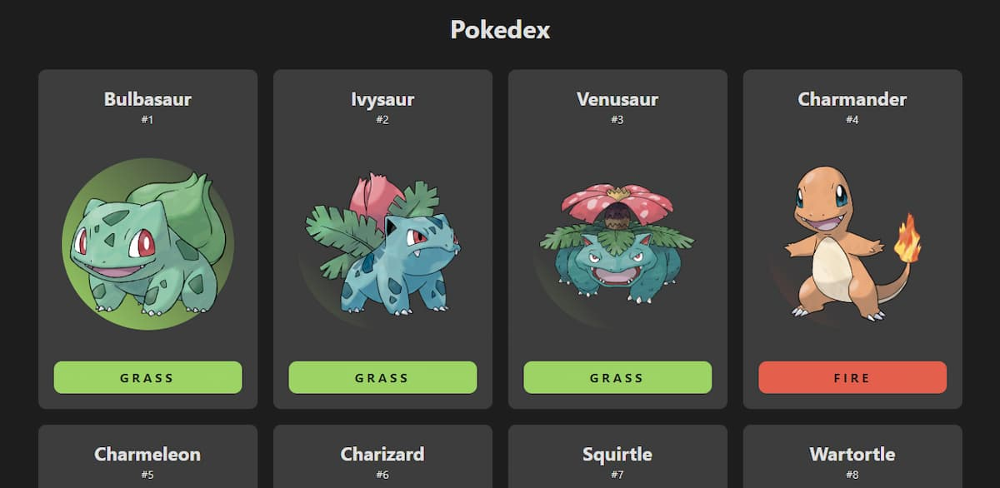

<h1 align="center"> Pokedex </h1>

  

Este projeto é baseado na Pokedex do desenho Pokemon. O projeto foi criado pelo Emerson Broga em Janeiro de 2021.

Para acessar o projeto, basta [clicar aqui](https://danieldpalma.github.io/portfolio/).

Caso não esteja funcionado, pode também acessar [clicando aqui](https://danieldpalma.github.io/portfolio/).

## Tecnologias

Projeto desenvolvido em HTML, CSS e Javascript.

Foi utlizado a API do [PokeApi](https://pokeapi.co/)

### Obs:

Foi acrescentado o tipo _ghost_ neste repositório.
